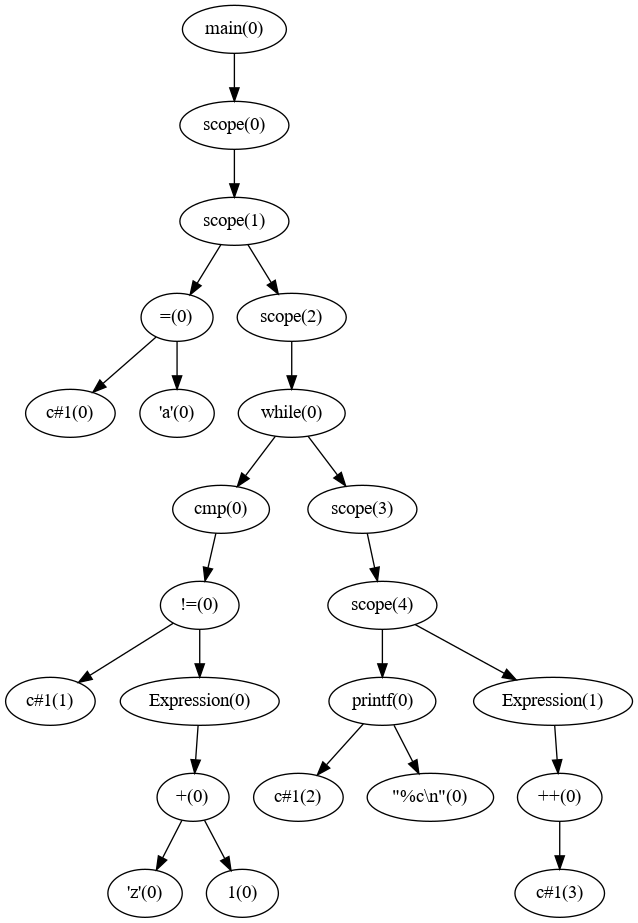

# Compiler Design


## Run the following command before testing

```bash
  chmod +x setup.sh
  ./setup.sh
```


## Example input
 
### Input   
Input file should be present in Test Directory

```bash
  ./ex.sh lol.c
```

lol.c contains : 

```c
int main()
{
  char c = 'a';
  while(c!=('z'+1)){
    printf("%c\n", c);
    ++c;
  }
}
```


### Output


Parse Tree:





Intermediate code : 

```bash
= 'a'   c#1
Label     l1
!=  c#1 123 t0
ifFalse t0    l2
Param c#1
Param "%c\n"       
call  printf  2 
= c#1   t2
+ t2  1 c#1
goto      l1
Label     l2
Label     l0
```

Assembly Code:

```assembly
.data
print_body0: .asciiz "%c\n"
lol0: .asciiz "a"
lol1: .asciiz "z"
c_1: .asciiz "a"
t0: .word 0
t1: .asciiz ""
t2: .asciiz ""
  .text
  .globl printf

printf:
  subu $sp, $sp, 36
  sw $ra, 32($sp)
  sw $fp, 28($sp)
  sw $s0, 24($sp)
  sw $s1, 20($sp)
  sw $s2, 16($sp)
  sw $s3, 12($sp)
  sw $s4, 8($sp)
  sw $s5, 4($sp)
  sw $s6, 0($sp)
  addu $fp, $sp, 36


  move $s0, $a0 
  move $s1, $a1
  move $s2, $a2
  move $s3, $a3

  li $s4, 0

  subu $sp, $sp, 36 
  move $s6, $sp


printf_loop: 
  lb $s5, 0($s0)
  addu $s0, $s0, 1 

  beq $s5, '%', printf_fmt 
  beq $0, $s5, printf_end 

printf_putc:
  sb $s5, 0($s6)
  sb $0, 1($s6)
  move $a0, $s6 
  li $v0, 4 
  syscall

  b printf_loop 

printf_fmt:
  lb $s5, 0($s0)
  addu $s0, $s0, 1
  beq $s4, 3, printf_invalidtag 
  beq $s5, 'd', printf_int
  beq $s5, 'c', printf_char
    beq $s5, 'f', printf_float 
  beq $s5, '%', printf_perc 

printf_invalidtag:
  sb $0, 2($s6) 
  sb $s5, 1($s6) 
  li $s5, '%'  
  sb $s5, 0($s6) 
  move $a0, $s6 
  li $v0, 4
  syscall
  b printf_loop 

printf_shift_args: 
  move $s1, $s2 
  move $s2, $s3 

  add $s4, $s4, 1 

  b printf_loop 


printf_shift_args_float: 
  mov.s $f0, $f1 
  mov.s $f2, $f3 

  add $s4, $s4, 1 

  b printf_loop 

printf_int: 
  move $a0, $s1 
  li $v0, 1
  syscall
  b printf_shift_args 

printf_float: 
  mov.s $f12, $f0 
  li $v0, 2
  syscall
  b printf_shift_args_float


printf_char:
  sb $s1, 0($s6) 
  sb $0, 1($s6)
  move $a0, $s6 
  li $v0, 4
  syscall
  b printf_shift_args

printf_perc: 
  li $s5, '%'
  sb $s5, 0($s6) 
  sb $0, 1($s6)
  move $a0, $s6
  li $v0, 4
  syscall
  b printf_loop 

printf_end:
  subu $sp, $fp, 36 
  lw $ra, 32($sp) 
  lw $fp, 28($sp)
  lw $s0, 24($sp)
  lw $s1, 20($sp)
  lw $s2, 16($sp)
  lw $s3, 12($sp)
  lw $s4, 8($sp)
  lw $s5, 4($sp)
  lw $s6, 0($sp)
  addu $sp, $sp, 36 
  jr $ra 
.globl main
main:
lb $a0 lol0
sb $a0 c_1
l1 : 
lb $a0 c_1
sw $a0 0($sp)
addiu $sp $sp -4
li $a0 123
lw $t0 4($sp)
sub $a0 $t0 $a0
addiu $sp $sp 4
sw $a0 t0
lw $a0 t0
beq $a0 0 l2
la $a0 print_body0
lb $a1 c_1
jal printf
lb $a0 c_1
sb $a0 t2
lb $a0 t2
sw $a0 0($sp)
addiu $sp $sp -4
li $a0 1
lw $t0 4($sp)
add $a0 $t0 $a0
addiu $sp $sp 4
sb $a0 c_1
b l1
l2 : 
l0 : 
li $v0 10
syscall

```


Simulating Assembly code using SPIM:

```bash
a
b
c
d
e
f
g
h
i
j
k
l
m
n
o
p
q
r
s
t
u
v
w
x
y
z
```
[Note : SPIM version and informations that displays on terminal before execution is being removed because of copyright issue]

